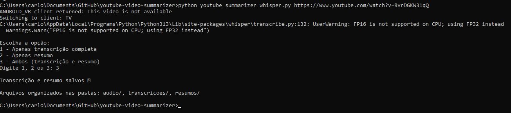
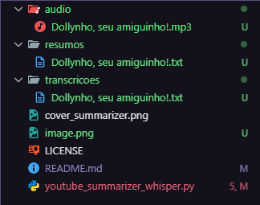

<div align="center">


  <h1 align="center">YouTube Video Summarizer</h1>

  <p align="center">
    <strong>Uma aplicação Python que transcreve e resume vídeos do YouTube usando Whisper local, sem depender de créditos da OpenAI. Ideal para estudo, pesquisa ou consumo rápido de conteúdo de vídeos longos.</strong>
  </p>

[](https://www.python.org/)
[](LICENSE)



</div>

## Funcionalidades

- Baixa vídeos do YouTube (apenas áudio) usando **pytubefix**
- Converte o áudio para MP3 usando **ffmpeg**
- Transcreve o áudio em texto com **Whisper local**
- Gera **resumo do vídeo** ou transcrição completa (opção do usuário)
- Salva os arquivos automaticamente nas pastas:
  - `audio/` → arquivos de áudio MP3
  - `transcricoes/` → transcrições completas
  - `resumos/` → resumos
- Funciona **offline**, sem limites de API

---

## Tecnologias Utilizadas

- **Python 3.12+**
- **pytubefix** → download de vídeos do YouTube
- **ffmpeg** → conversão de áudio
- **Whisper (OpenAI)** → transcrição de áudio local
- **re** → limpeza de nomes de arquivos

---

## Requisitos

- Python 3.12+
- **ffmpeg** instalado no sistema (https://ffmpeg.org/)
- Bibliotecas Python:

```bash
pip install pytubefix ffmpeg-python git+https://github.com/openai/whisper.git
```

## Estrutura de Pastas:

```bash
youtube-video-summarizer/
│
├─ audio/           # Arquivos MP3 dos vídeos
├─ transcricoes/    # Arquivos de transcrição completa
├─ resumos/         # Arquivos de resumo
├─ youtube_summarizer_whisper.py
├─ README.md
└─ LICENSE
```

### Clone o repositório:

```bash
git clone https://github.com/SEU_USUARIO/youtube-video-summarizer.git
```

### Entre na pasta do projeto:

```bash
cd youtube-video-summarizer
```

### Instale as dependências:

```bash
pip install -r requirements.txt
```

**(ou instale manualmente conforme listado nos requisitos)**

## Como Usar

**1°** Abra o terminal na pasta do projeto.

**2°** Rode o script com a URL do vídeo do YouTube:

```bash
python youtube_summarizer_whisper.py <URL_DO_VIDEO>
```

### Exemplo:

```bash
python youtube_summarizer_whisper.py https://www.youtube.com/watch?v=RvrDGKW31qQ
```

**3°** Escolha a opção que deseja gerar:

```bash
1 - Apenas transcrição completa
2 - Apenas resumo (se maior que 500 caracteres)
3 - Ambos (transcrição e resumo)
```

**4°** O resultado será exibido no terminal e os arquivos salvos nas pastas correspondentes.



### Modelos do Whisper:

```bash
| Modelo | Velocidade   | Precisão           |
| ------ | ------------ | ------------------ |
| tiny   | Muito rápido | Menor precisão     |
| base   | Rápido       | Média precisão     |
| small  | Médio        | Mais preciso       |
| medium | Lento        | Alta precisão      |
| large  | Muito lento  | Excelente precisão |
```

O script utiliza small por padrão, que é um bom equilíbrio entre velocidade e precisão.

## Observações:

- Vídeos longos podem levar alguns minutos para processar

- Funciona em Windows, macOS e Linux

- Garante nomes de arquivos seguros, evitando caracteres inválidos

- Permite escolher entre transcrição completa ou resumo automático

## Colaboradores


## Licença

Youtube Video Summarizer está licenciado sob a Licença MIT.
